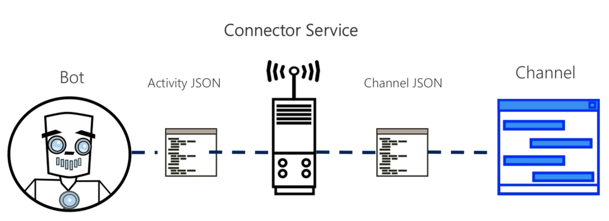

# Bots

## History
- 1960: ELIZA
- 1970: PARRY
- 1980: Graphic interface
- 1990: Search engines
- 2000: Social/App stores
- 2010: Bots and agents, human Interaction/Experience

## Type of Chatbots
- **Utilities:** It fulfills a function for the users and is measured according to the effectiveness of the answers.
- **Social:** Success is measured according to the duration and level of user satisfaction, it is also possible to assess the level of satisfaction through APIs to recognize the level of emotion of users.
- **Assistants (Cortana, Siri, etc):** Acts as a facilitator, usually comes integrated with the Operating System. Main features:
  * Utilities and social capacities
  * Continuous relationship with the user
  * Manage system functions

## Communication flow
List the functions offered by the bot and describe a step by step for its execution:
- Task
- Objective
- Motivation of the user
- Steps
- Forecasts

## Experience components
- Learning and memory
- Perception and sense
- Personality (Intelligence)
- Logic and reason
- Accessibility
- Meaning and tone of text
- Cards
- Images
- Emojis
- Response time
- Conversational branch

## Design
- Inclusive design (Design for all types of public)
- UX (Avatar)
- Character with personality
- Define the devices and channels to support (Cortana, Email, Facebook, etc)
- Form flow (conversation follow-up, validate the data)
- Prevent redirections

# Bot Framework
Open Source Framework to create and connect bots (Cross channel, AI and Up-to-Date resources).

## Bot Connector Service 
Integrate the bot with different channels as Slack, Skype, Messenger, Sms, etc.

## Bot Developer SDKs 
SKDs for .NET, NodeJS or using only REST APIs.

## Bot Builder SDK 
Integrate external services and Manage the conversation using LUIS system - Language Understanding Intelligent Service.

